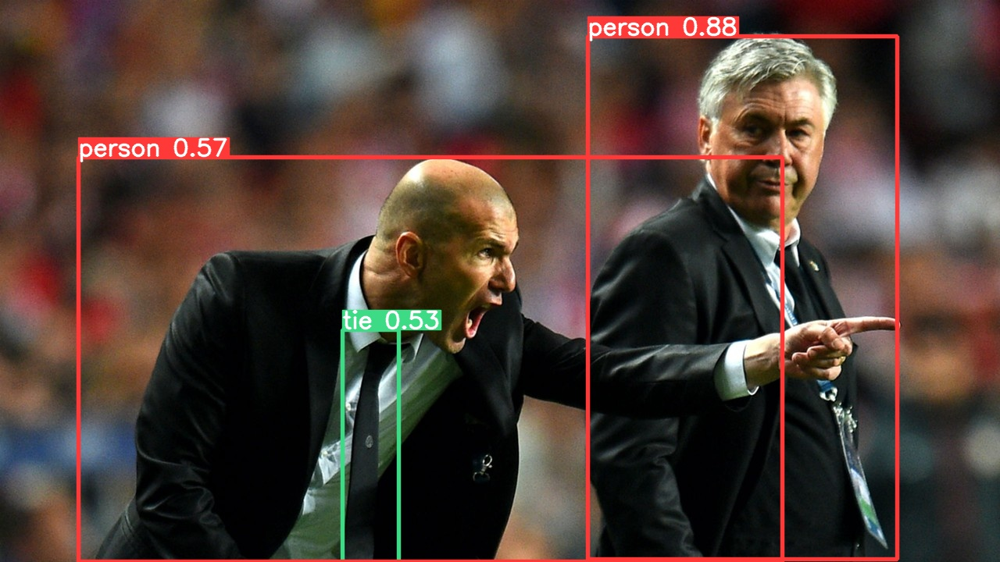

# Projekt WDSI - detekcja znaków przejść dla pieszych
## Złożenia i dobór modelu
Celem projektu było storzenie klasyfikatora byłby w stanie rozpoznawać znaki przejśc dla pieszych. Algorytm powinien wykonywać swoje zadanie precyzyjnie a sama detekcja powinna odbywać się retywnie szybko.

Biorąc pod uwagę wymagania projektu uznałem żę nalepiej nadanjącym się do tego celu jest algorytm YOLO wykorzytsujący sieci konwolucyje. Jako że wymagamy od nszego alogrymu prędkości to YOLO jest dośc oczywistym woborem gdyż dział zdecydowanie szybciej niź RCNN (regionowe konwolucyjne sieci neuronowe) jednocześnie będąc prawie tak dokładna. Poniżej widzimy jeden z przykładowy obraz pokazujący działania YOLO.



Jak widać algorytm oprócz lokalizacji obiektu pokazuje również prawdopodobieństwo przynależności do klasy. Próg ufności oznaczający minimalne prawdopodobieństwo, aby przyznać obiekt do klasy jest jednym z parametrów który należy dobrać, ale tym zajmiemy się po wytrenowaniu modelu.

## Przygotowanie danych 

Zbiór danych z którego korzytamy zawiera adnotacje do obrazków w formacie .xml wyglądające jak poniżej. 

```
<annotation>
    <folder>images</folder>
    <filename>road1.png</filename>
    <size>
        <width>400</width>
        <height>283</height>
        <depth>3</depth>
    </size>
    <segmented>0</segmented>
    <object>
        <name>trafficlight</name>
        <pose>Unspecified</pose>
        <truncated>0</truncated>
        <occluded>0</occluded>
        <difficult>0</difficult>
        <bndbox>
            <xmin>154</xmin>
            <ymin>63</ymin>
            <xmax>258</xmax>
            <ymax>281</ymax>
        </bndbox>
    </object>
</annotation>
```
Od razu możemy zobaczyć dwa problemy:
- adnotacje są w plikach .xml kiedy yolo przyjmuje pliki .txt
- ramki zapisane są za pomocą <xmin, ymin, xmax, ymax> kiedy powiny wyglądać następująco <x, y, w, h>
Przykłądowa ramka yolo
```
klasa_n x y szerokość wysokość
```
Do przygotowania danych korzytam z fukcji ` xml2dic(xml_file)` która odczytuje dane z pliku xml i zapisuje je w słowniku 
```
<Element 'annotation' at 0x7fbc53a0ce50>
{'bboxes': [{'class': 'trafficlight',
   'xmin': 20,
   'ymin': 109,
   'xmax': 81,
   'ymax': 237},
  {'class': 'trafficlight',
   'xmin': 116,
   'ymin': 162,
   'xmax': 163,
   'ymax': 272},
  {'class': 'trafficlight',
   'xmin': 189,
   'ymin': 189,
   'xmax': 233,
   'ymax': 295}],
 'filename': 'road4.png',
 'image_size': (267, 400, 3)}
```

Następnym krokeim jest przeliczenia pozycji ramek na ten obsługiwany przez YOLO.

```
center_x = (b["xmin"] + b["xmax"]) / 2 
center_y = (b["ymin"] + b["ymax"]) / 2
width    = (b["xmax"] - b["xmin"])
height   = (b["ymax"] - b["ymin"])

center_x = center_x / img_w 
center_y = center_y / img_h 
width    = width / img_w 
height   = height / img_h 
```
Po przeliczeniu pozycji pozostaje zapisanie ramki w pliku .txt o takiej same nazwie jak opiswany obraz. Opisywane wyżej czynności wykonywane są przez fukcje `dict2yolo(data_dict)`. Warto też zauważyć że używany przezemni zbiór danych zawiera zdjęcia wileu znaków ja zpisuje jedynie znaki przejśc dla piszych. Ponieważ tylko one potrzebne są do wuczenia sieci. 

# Podział danych

Obrobione dane dzielę na trzyz zbiory:
- zbiór uczący 80%
- zbiór walidacyjny 10%
- zbiór testowy 10%

Po podziale danych przenosze je do odpowadających folderów.

Aby zaoszczędzić miejsce ale zobrazować strukturę danych pozostawiłęm puste foldery annotations oraz images ale fodery w Road_Sign_Dataset są gotowe do trenowania YOLO. Jesli chcę się odwtorzyć procedurę przygotowani danych należy umieścić adnotacje i zdjęcia w folderach annotations oraz images i przejść procedurę sortowania plików.

# Nauka 
Wymagane biblioteki:
```
tqdm
torch
seaborn
torchvision
tensorboard
```
Przed rozpoczęciem nauki skonfigurowałem plik road_sign_data.yaml

```
train: ../Road_Sign_Dataset/images/train/ 
val:  ../Road_Sign_Dataset/images/val/
test: ../Road_Sign_Dataset/images/test/

# number of classes
nc: 1

# class names
names:  ["crosswalk"]
```

Aby rozpocząć uczenie nalezy w pliku yolo_v5 otworzyć terminal i użyć następującej komendy.

```
python3 train.py --img 440 --cfg yolov5s.yaml --hyp hyp.scratch.yaml --batch 24 --epochs 100 --data road_sign_data.yaml --weights yolov5s.pt --workers 24 --name yolo_road_det
```
Wybrane przeze mnie parametry:
- img 440 - wielkośc wejściowego obrazu
- hyp hyp.scratch.yaml - domyslne hiperparametry sieci
- data road_sign_data.yaml - ścierzka do pliku konfigracyjnego yaml
- weights yolov5s.pt - bazowe wagi modelu


Otrzymane przezmnie wyniki uczenia 


Przykładowa detekcja:


# Testowanie
Do testowania niepotrzebne jest ponowne trenowanie sieci, ponieważ wagi zapisane są w runs/train/yolo_road_det25/weights/best.pt.

Aby uruchomić procedurę testowania obrazy należy umieścić w folderze Road_Sign_Dataset/images/test a następnie uruchomić następującą komendę.

Do detekcji korzystam z tak zodyfikowanej fukcji detect.py (fukcja z repo YOLOv5) aby zwracał w terminalu wyniki detekcji według wytycznych projektu. 

'''
python3 detect.py --source ../Road_Sign_Dataset/images/test/ --weights runs/train/yolo_road_det25/weights/best.pt --conf 0.25 --name yolo_road_det --nosave
'''
Wybrane przeze mnie parametry:
- weights runs/train/yolo_road_det25/weights/best.pt nazwa najlepszych (według zbioru walidacyjnego) parametrów otrzymanch podczas uczenia
- source ../Road_Sign_Dataset/images/test/ - ścieżka do danych do testu/detekcji
- conf 0.25 - próg ufności, czyli minimalne prawdopodobieństwo, aby zatwierdzić klasę

Wyniki testu w terminalu:


Jeśli chcę się wygenerowa obrazy png z należy zmienić usunąć flagę --nosave, obrazy png z ramkami generowane będą do folderu yolo_road_det w yolo_v5/runs/detect.

Jeśli chcę się przetestować działania po własnym wytrenowaniu algorytmu wystarczy zmienić runs/train/yolo_road_det25/weights/best.pt na runs/train/yolo_road_det/weights/best.pt. Pozostałe trenowania zostały usunięte więc kolejne trenowanie zapiszę się pod yolo_road_det.
